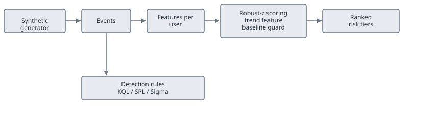

# insider-access-drift

Peer-relative access-drift scoring and insider-risk detections, built and validated on synthetic data.

## What this is

An engineering-practice project. It is not a product to run in place of a SIEM or a UEBA. It has two parts over one access-log schema: four insider-risk detection rules (KQL, SPL, Sigma) and a scorer that ranks users by how far their access sits from their peers.

The two parts do different jobs. The detections are the deployable part: signature rules you run in your SIEM, in real time, on data that is already there. If operational detection is all you want, use them and skip the scorer. The scorer does the thing a signature cannot. It flags the person who never trips a single rule but drifts from their peer group over weeks, and it ranks a queue instead of firing yes-or-no alerts. A commercial UEBA does this better and in real time. This is a small, readable version of the same idea, useful as a demonstration, as a triage layer on top of the detections, or where no UEBA is available.

## Threat model

The risk is an insider with legitimate access. An employee or contractor who already has a login can reach past what the job needs, or move sensitive material toward the door, and in most logs it looks like ordinary work. There is no malware and no failed login. There is valid access, used wrong.

This tool watches access telemetry for that pattern: who touched which resource, how sensitive it was, whether it left the company, and when. It does not model recruitment, payment, or motive, which happen off the network. It models the one thing that leaves a trail, the access itself. A malicious insider, a careless one, and a stolen account all look the same here: access that drifts from a peer baseline.

Everything runs on synthetic data generated in the repo. There is no real user or company, and nothing here names an insider. The scorer and the rules produce triage, a ranked list and a few flagged rows for an analyst to look at. Nothing decides anything or takes an action.

## Telemetry schema

An access event is a row with nine required columns, checked by `insider_access_drift.schema.validate_events` before anything else runs.

- `user_id`, `peer_group`: who acted, and which baseline they are compared against.
- `resource_id`: what they touched.
- `resource_sensitivity`: 0 to 3, low to crown jewel. Outside that range fails validation.
- `action`: `view`, `download`, `clone`, `export`, `share`, `delete`, or `permission_change`. Any other action still parses and scores as a flat 0.5.
- `bytes_out`: bytes moved off the resource.
- `external_share`: 0 or 1, whether the action left the company boundary.
- `after_hours`: 0 or 1, whether it happened outside working hours.
- `event_time`: a parseable timestamp.

`validate_events` raises `SchemaError` rather than coercing bad input. A bad sensitivity value, a bad flag, or an unparseable timestamp stops the run before scoring.

Two of these columns are not raw telemetry. `resource_sensitivity` and `peer_group` are enrichments you supply from a classification program and an identity or HR source. See `docs/configuration.md` for how they get populated.

## Quick start

    pip install -e .
    python -m insider_access_drift generate --out events.csv
    python -m insider_access_drift score --in events.csv

`generate` writes a fixed-seed log: three benign peer groups (engineer, sales, contractor) and three seeded bad actors, a slow accumulator, an after-hours crown-jewel puller, and a contractor with broad restricted-resource reach. `score` reads any CSV matching the schema, ranks users, and prints `user_id`, `peer_group`, `drift_score`, and `risk_tier`. Add `--out ranked.csv` to write the full scored table, and `--config file.json` to override the dials.

## How scoring works

Scoring runs in three steps: aggregate each user's events into eight features (`user_features`), add a trend feature (`add_trend_feature`), then score (`score`). `score` reads the trend column, so `add_trend_feature` runs first. The CLI does both for you.

Each feature is scored against the user's peer group, not the whole company, with a robust z-score: median-centered, scaled by the median absolute deviation, negatives clipped to zero because only high activity matters. If a group's deviation is zero, which happens in small groups with many tied values, it falls back to standard deviation, and if that is also zero the group scores zero.

A group needs enough data for the comparison to hold. `min_peer_size` (4 users) and `min_peer_events` (20 events) gate it. A group under either gets `insufficient_baseline` instead of a score. Comparing one person against three others is not a baseline.

The trend feature splits each user's history at the midpoint and measures how much their sensitive-access activity rose from the first half to the second. It catches the slow accumulator: no single bad day, but more sensitive access each week than the week before.

The eight features are combined as a weighted sum. Each weight reflects how much the observable is worth on its own:

| Feature | Weight | Reason |
| --- | --- | --- |
| `distinct_resources` | 0.8 | breadth of access, weak alone since some roles touch many resources |
| `restricted_touches` | 1.2 | reaching restricted material, narrower than raw resource count |
| `crown_jewel_touches` | 1.8 | the strongest single exfiltration signal |
| `weighted_sensitivity` | 1.3 | total sensitive activity, weighted by action |
| `mb_out` | 1.2 | bulk data movement |
| `external_share_rate` | 1.5 | sharing outside the company |
| `after_hours_rate` | 0.7 | weak alone, since off-hours work is common |
| `sensitivity_trend` | 1.0 | slow accumulation over time |

`drift_score` is the weighted sum of the robust z-scores. Above `high_threshold` (8.0) is `high_review`, above `moderate_threshold` (4.0) is `moderate_review`, the rest is `baseline`. Weights and thresholds are config, tuned per deployment.

## Configuration

Every dial (the feature weights, the tier thresholds and baseline gates, the per-action weights, the sensitivity cutoffs, and the detection thresholds) is one object, `insider_access_drift.config.Config`, with working defaults. Override any of it from a JSON file:

    python -m insider_access_drift score --in events.csv --config my-config.json

`docs/configuration.md` lists every dial and how the two operator-owned inputs get populated. `docs/operational-workflow.md` has the deployment workflow and a flowchart.

## Detections

Four rules, each as a pandas reference under `detections/reference/` and as a platform-native query.

| Rule | Native file | ATT&CK | D3FEND |
| --- | --- | --- | --- |
| Repository access drift | `detections/kql/repository_access_drift.kql` | T1213, T1078 | Resource Access Pattern Analysis |
| Contractor blast radius | `detections/kql/contractor_blast_radius.kql` | T1078 | Resource Access Pattern Analysis |
| Crown-jewel download burst | `detections/splunk/crownjewel_download_burst.spl` | T1213, T1567 | User Behavior Analysis |
| External share after hours | `detections/sigma/external_share_after_hours.yml` | T1567 | User Behavior Analysis |

The rules are written against this project's normalized schema, the nine columns above. They are not tied to any one SIEM's native tables, and they are not drop-in content. A real deployment maps these fields onto its own sources and supplies the enriched columns (sensitivity, peer group, external-share, after-hours) that raw logs do not carry. Treat them as validated logic to adapt, not paste-and-run rules.

The logic is checked two ways. The pandas reference runs on every push against the seeded personas and asserts the right users are flagged. The native KQL and SPL run for real in two scheduled jobs, against a Splunk container and the Kusto emulator, on the same synthetic events. Setup and the verify-at-build items are in `docs/validation.md`.

## Privacy guardrails

- Collect the nine schema columns and nothing else. No message bodies, no file contents.
- Anyone whose access is scored should know a system does this and what it looks at. Silent behavioral scoring of employees is its own risk.
- Every output is triage for a human. `risk_tier` sets who to look at first. It does not replace looking.
- A drift score is not evidence. It should not enter an HR or legal process as if it were. It is a statistical outlier against a peer baseline, and peer baselines are often wrong.

## Limitations and failure modes

Peer grouping is the dependency the whole thing rests on. Here it comes from three clean synthetic categories. Real job-role data is messy, and a user in the wrong peer group is compared against a baseline that has nothing to do with their job. Someone doing legitimately broad cross-team work will score high for no real reason.

Small teams break the baseline, which is why `insufficient_baseline` is its own tier. In a four-person group, one person having an odd week can look like a group-wide shift.

The scorer has no sense of a business cycle. A quarter-end close, a migration, or an audit spikes normal access for a whole team and reads like a coordinated push, unless the peer baseline moves with it.

None of this is evidence. It is a ranked list built on assumptions that will not hold exactly in a real environment. It says where to look first, not what you will find.

## Roadmap

An LLM access-narrative explainer, not built yet. It would take a flagged user's event sequence and write the plain-language summary (for example, download volume to one repository roughly tripled over two weeks while staying under the crown-jewel threshold) in place of a bare score. It would run offline against local events, not send a flagged user's activity to a third-party API.

## License

MIT. See `LICENSE`.
