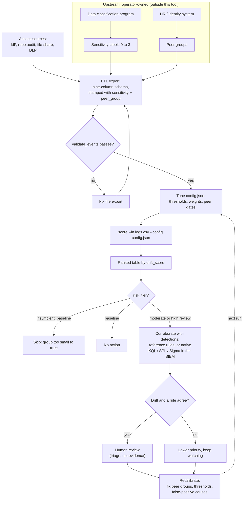

# Operational workflow

How this tool runs against real access logs in a deployment, end to end. For the synthetic quick loop and the full dial reference, see `configuration.md`.

The two columns that drive everything, `resource_sensitivity` and `peer_group`, are inputs you supply. They come from programs that live upstream of this repo (data classification, HR or identity), shown at the top of the diagram as operator-owned. This tool assumes they already exist and are populated correctly. It does not build them, and it is only as good as they are.

## The steps

1. **Settle the two inputs first.** Define your peer groups (from HR or identity) and your sensitivity labels (from your classification program). This is the load-bearing work, and it happens before and outside this tool. No labels means that is the first project, not this one.
2. **Build the export.** Emit the nine-column schema from your access sources (identity-provider sign-ins, repository audit logs, cloud file-share events, DLP events), stamping `resource_sensitivity` from your label source and `peer_group` from your role data onto every row.
3. **Validate a sample.** `insider_access_drift.schema.validate_events` raises on missing columns, bad sensitivity values, bad flags, or unparseable timestamps, so a malformed export fails before scoring rather than silently mid-run. Fix the export until it passes.
4. **Tune a `config.json`.** Start from the defaults, raise `min_peer_size` if your teams are large, set the thresholds to the alert volume your reviewers can absorb, and reweight features toward the behavior you care about. Every dial is in `configuration.md`.
5. **Score.** `python -m insider_access_drift score --in yourlogs.csv --config config.json --out ranked.csv`.
6. **Read top down.** `high_review` first, then `moderate_review`. Skip `insufficient_baseline` groups, which are too small for the comparison to mean anything, and `baseline`, which is everyone else.
7. **Corroborate with the detections.** Run the reference rules against the same log, or deploy the native KQL, SPL, and Sigma in your SIEM, and see which flagged users a rule also catches. Two independent methods agreeing is a stronger signal than a drift score alone.
8. **Route to a human.** A case where the drift score and a detection agree goes to a reviewer. Everything here is triage, where to look first. It is not evidence, and it does not feed an automated response or an HR or legal process as if it were.
9. **Recalibrate.** Watch what turns out to be a false positive: a quarter-end close, a migration, a legitimately broad cross-team role, a mis-assigned peer group. Fix the peer-group data and the thresholds, and the next run reflects it. The peer baseline shifts as teams and roles change, so keeping it honest is ongoing work.

## The guardrail, restated

The loop ends at a human, on purpose. No branch of this flow revokes access, files a report, or takes any action on its own. A high drift score with a corroborating detection is a reason to look closer, the same as any other alert. The tool orders the queue. A person still decides what sits at the top and what to do about it.
